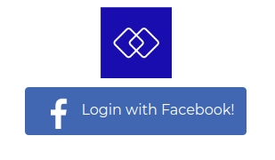
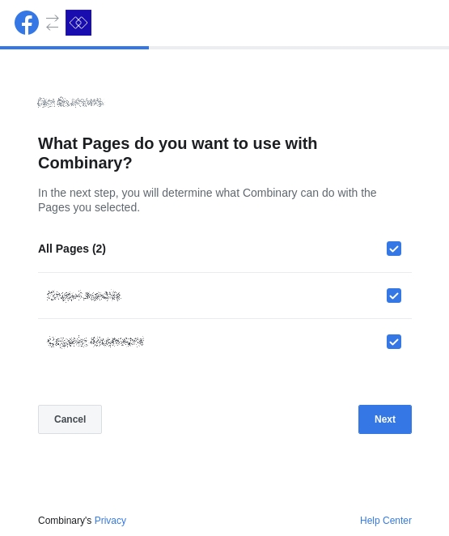
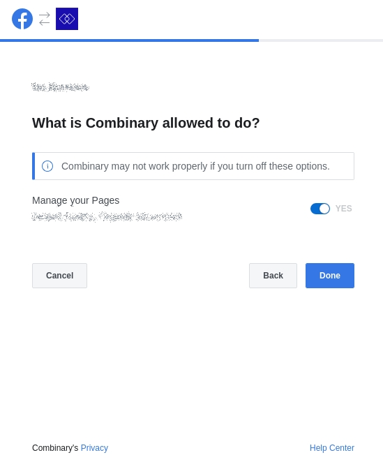
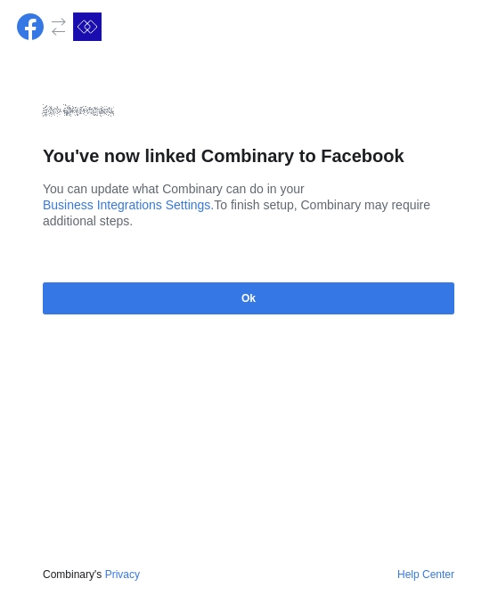
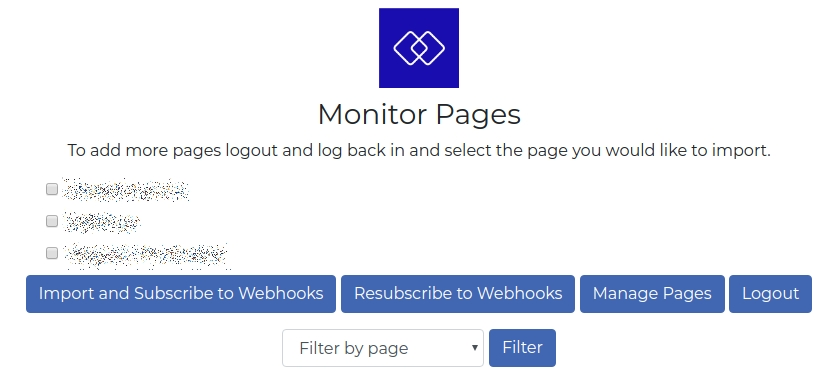
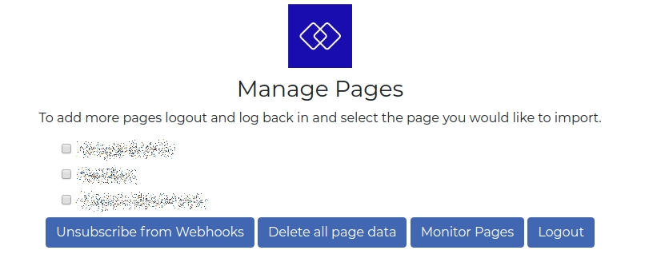

# Connect Account

Quick Video walkthrough on [Youtube](https://youtu.be/s4KRN7UuKPY)

Login to the application using your Facebook credentials.

### Monitor

Select the pages you would like to import and then monitor using a webhook.

_**Import and Subscribe to Webhooks**_ to import data from your managed pages and subscribe to a webhook. Once imported the webhooks are setup and new posts and reactions will be added to the database. 

_**Re-Subscribe to Webhooks**_ to subscribe to a webhook again if the subscription was removed in the _**Manage Pages**_ page.

_**Manage Pages**_ to navigate to the management page where you can remove webhook subscriptions and remove your data.

_**Logout**_ to logout from the service.

_**Filter**_ to select a page and show metrics for that page.

### Manage

_**Unsubscribe from Webhooks**_ to remove webhook subscriptions and stop monitoring your pages.

_**Delete all page data**_ to delete all data for a page from the database. 

_**Monitor Pages**_ to return to the monitoring page.

_**Logout**_ to logout from the service.

If you would like to give permissions for other pages then logout and log back in to select the required pages.

