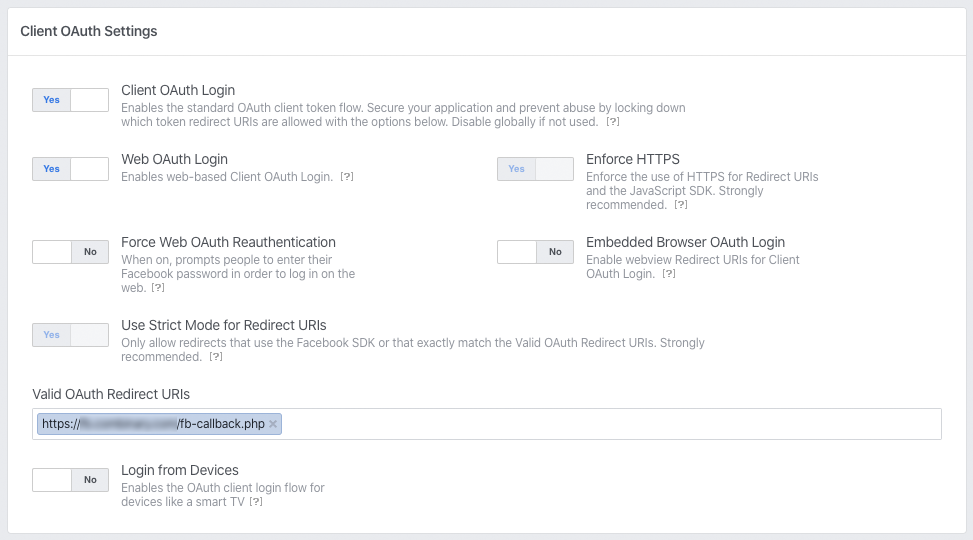

# Facebook App

You need to create a verified Facebook App  
Products you need to activate:

* **Facebook Login** **OAuth Settings:**   
* **Webhooks \(Type: User\)**
  * **Callback URL** Validation requests and Webhook notifications for this object will be sent to this URL. `https://<DOMAIN>/webhooks.php`
  * **Verify Token** Token you set in your environment Variables

