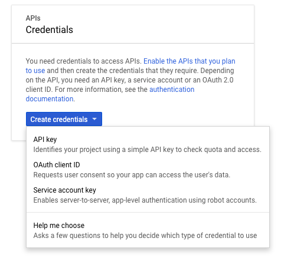

# Create Youtube API Key

go to `https://console.developers.google.com`

* create a new project
* add credentials &gt; API key

* add a Library &gt; YouTube Data API v3

* Restrict your API Key
* done

